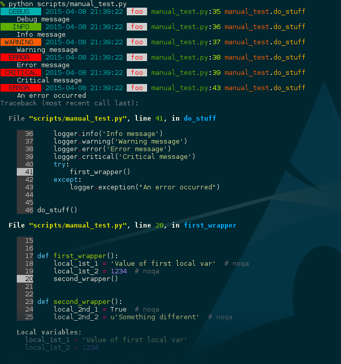

Nice Log
########

.. image:: https://circleci.com/gh/rshk/nicelog.svg?&style=shield
   :target: https://circleci.com/gh/rshk/nicelog
   :alt: CircleCI build status

Provide formatters to nicely display colorful logging output on the console.

`Fork this project on GitHub <https://github.com/rshk/nicelog>`_

Right now, it contains only one formatter, coloring log lines
depending on the log level and adding nice line prefixes containing
logger name, but future plans are to add more formatters and allow
better ways to customize them.

Installation
============

::

   pip install nicelog

Quick usage
===========

Since version ``0.3``, nicelog comes with a helper function to quickly
set up logging for basic needs.

.. code-block:: python

    from nicelog import setup_logging

    setup_logging()

Or, if you want to include debug messages too:

.. code-block:: python

    setup_logging(debug=True)

Advanced usage
==============

.. code-block:: python

    import logging
    import sys

    from nicelog.formatters import Colorful

    # Setup a logger
    logger = logging.getLogger('foo')
    logger.setLevel(logging.DEBUG)

    # Setup a handler, writing colorful output
    # to the console
    handler = logging.StreamHandler(sys.stderr)
    handler.setFormatter(Colorful())
    handler.setLevel(logging.DEBUG)
    logger.addHandler(handler)

    # Now log some messages..
    logger.debug('Debug message')
    logger.info('Info message')
    logger.warning('Warning message')
    logger.error('Error message')
    logger.critical('Critical message')
    try:
        raise ValueError('This is an exception')
    except:
        logger.exception("An error occurred")

Example output
==============

Here it is, in all its glory:

The output format can be further customized, eg. if you want to reduce
colorfulness or verbosity.

Integrations
============

Django
------

I usually put something like this in my (local) settings:

.. code-block:: python

    LOGGING['formatters']['standard'] = {
        '()': 'nicelog.formatters.Colorful',
        'show_date': True,
        'show_function': True,
        'show_filename': True,
        'message_inline': False,
    }
